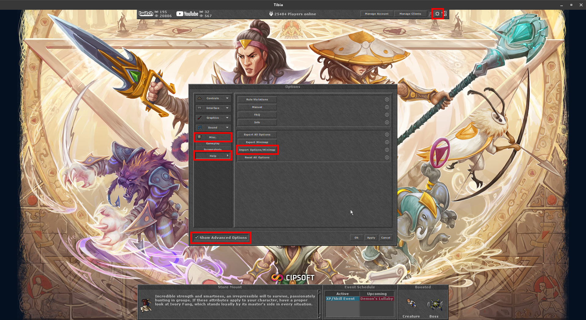

# 🎮 TibiaConfigs

Guia para instalação e configuração do ambiente Linux + Tibia.

---

## :one: **Baixar e Instalar o Linux Lite 7.2**

- Baixe a ISO do Linux Lite 7.2 (64 bits) [**aqui**](https://mirror.accum.se/mirror/linuxliteos.com/isos/7.2/linux-lite-7.2-64bit.iso).

- Para criar um pendrive ou DVD bootável, siga este tutorial em vídeo:  
  :tv: [**Como criar um pendrive bootável**](https://www.youtube.com/watch?v=gXorVu1_B2A)

- Após criar o pendrive/DVD, instale o Linux Lite 7.2 no seu computador.

---

## :two: **Configuração Inicial do Sistema**

- Baixe o arquivo `ConfigInicial.sh` e coloque-o na **Área de Trabalho**.

- No terminal, execute os comandos abaixo:

```bash
chmod +x ConfigInicial.sh
./ConfigInicial.sh
```

---

## :three: **Configurar o Jogo**

1. No cliente do Tibia, vá em:  
   **Settings > Show Advanced Options > Misc > Help > Import Options/Minimap**

2. Quando solicitado, selecione o arquivo **TibiaConfigHotkeys** localizado na sua **Área de Trabalho**.

3. Reinicie o jogo após a importação.

### 🖼️ Exemplo da tela:



---

## :four: **Baixar o Repositório PyTibia**

- Baixe o repositório [**PyTibia no Linux**](https://github.com/lucasmonstrox/pytibia-no-linux) e coloque a pasta na **Área de Trabalho**.
